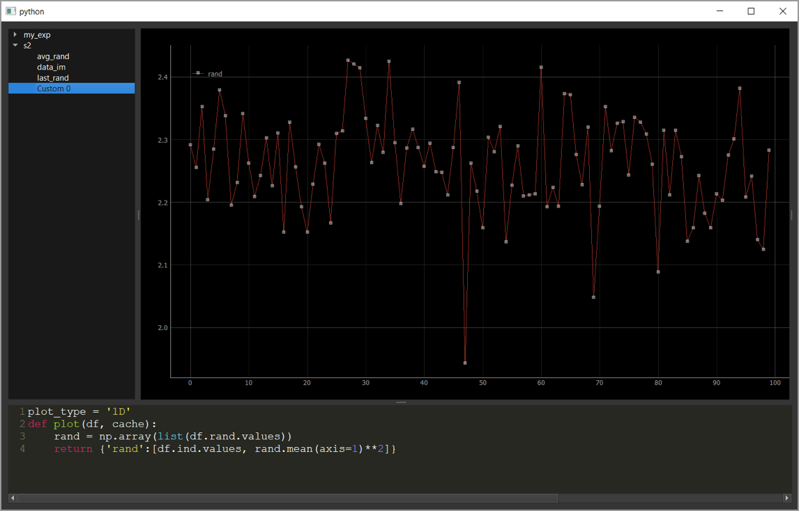

.. attention::
   
   We know some of these webpages could use some work -- this documentation has only recently been created and is in active development. It is updated regularly, so check back weekly.

View Manager
============

The view manager is an NSpyre widget that allows us to visualize the data
stored in the database. Like the other components of the NSpyre framework,
it can run independently from any computer connected to the network.

We can manually activate the view manager from our cmd window by loading the view_manager.py file in nspyre\nspyre\widgets:

.. code-block:: console
   
   $ conda activate nspyre
   (nspyre) $ cd C:\root\nspyre\nspyre\widgets
   (nspyre) $ python view_manager.py

Loading the file successfully should prompt a view manager window to open. In that window we can see the experiments specified by our config.yaml file. Since we acquired data running the s2 experiment, we can see it plotted in different predefined forms under the s2 list. For example, try clicking on avg_rad, which plots the average value of each of 100 random arrays. Click on data_im and last_rand to see the different predefined plots for the s2 experiment.

.. image:: images/s2-experiment.png

Notice that the code for each predefined plot function is given in an editable form at the bottom of the View Manager window.  Pressing ``‘Ctrl + c’`` will generate a new, custom plot (named Custom 0) in-which you can define a different plot function. This is very useful if you want to slightly tweak one of the predefined plots, but in order to make a plot function automatically available upon running an experiment, you should add it in your spyrelet file (here test_spyrelets.py). For example, you can plot the square mean random value by simply copy-paste the avg_rand code into the Custom 0 box while adding **2 appropriately and pressing ``‘Shift + Enter’``.
   
The plot functions within the spyrelet file can be defined as 1D or 2D plots. 1D plots return a dictionary with the name of the parameter as a keyword with the associated value being an array of x-arrays and y-arrays. 2D plots similarly return a 2D array.
   
Another function that can be added to the spyrelet is a plot formatter. These can be used to set plot properties (like color, labels, etc.) at the start of the run with @PlotFormatInit  or ones that are being updated with each plot with @PlotFormatUpdate.

NSpyre GUIs
-----------

The NSpyre framework can also be controlled by a series of graphical user interfaces (GUIs). You can activate the test spyrelet GUI by uncommenting/typing the spyrelet launcher command on your code file, *Notebook _Example.ipynb* or The Instrument Server and *Spyrelet.ipynb*.

.. code-block:: python
   
   # Make a launcher
   launcher = Combined_Launcher(spyrelets=all_spyrelets)

A GUI containing both experiments in the test spyrelet should appear. Through this GUI you can set your experimental parameters and run or stop the experiment in a press of a button. While the experiment is running in the background, you can still manipulate the code in your editor and even read data.

.. image:: images/gui-example.png

Let’s run two s2 experiments with 300 iterations, stop them at any time while running, and save them to the tutorial folder (C:\Jupyter Scripts\Alex's tutorial) as test1.json and test2.json. We can now view and open the saved data using the data explorer GUI. You will need to activate it in your cmd window from nspyre\nspyre\widgets.

Once the GUI appears, you can view, open, and even manipulate the saved data, similarly to a MATLAB figure.

.. code-block:: console
   
   (nspyre) $ python data_explorer.py
   Loading C:/Jupyter Scripts/Alex’s tutorial/test1.json
   Loading C:/Jupyter Scripts/Alex’s tutorial/test2.json

Once loaded, the data explorer GUI shows the saved test1.json and test2.json files with a viewer that allows the user to manipulate the plots:

.. image:: images/data-explorer-gui.png

NSpyre main GUI
^^^^^^^^^^^^^^^

Now that we are familiar with the direct execution of each part of the NSpyre framework, both directly from the editor and through designated GUIs, we can simplify the process using the NSpyre main GUI. This GUI allows us to connect to the instrument server, as well as open and control each of the GUIs discussed above from a single GUI window.

Close all your running cmd windows except your lantz-sim and your editor (if applicable) window. You should now be disconnected from the instrument server. Use your cmd to run the file main.py from the nspyre\nspyre\widgets folder.

.. code-block:: console
   
   (nspyre) $ python main.py

The main GUI should open, featuring 5 buttons. Pressing the ‘Start Instrument Server’ button would be equivalent to loading instrument_server.py and would connect to the instruments specific in the config.yaml file. The instrument manager opens a list of the instruments and their parameters, with the option to set the read/write attributes. We already discussed the View Manager, the Spyrelet Launcher, and the Data Explorer. These specific GUIs would pop-up upon pressing the relevant button. Once your config.yaml and spyrelets are complete, you can essentially operate everything from this GUI. However, you should still take time to learn the code itself. This will come in handy for debugging or when changes need to be made.

